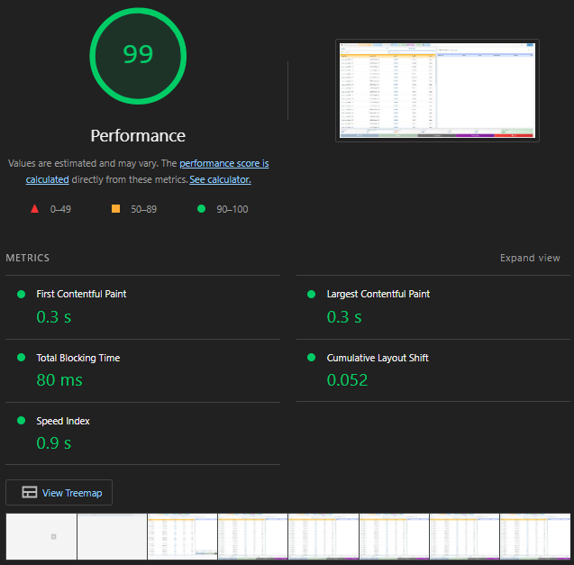
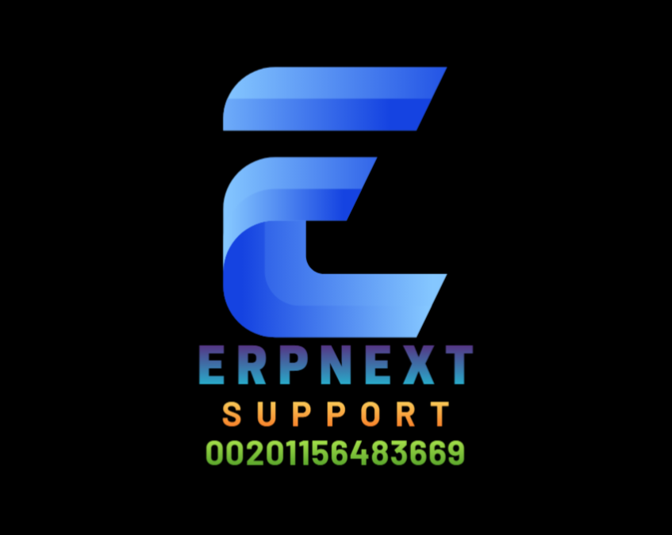

# POS Awesome Lite

    
    <h2>POS Awesome Lite</h2>
    
<em>Point of Sale for ERPNext v15</em>

---

## 🎯 Goal

    

**POS Awesome Lite** = Modern Interface + Original ERPNext Engine

Just a lightweight web interface built on top of ERPNext's proven foundation:

-   🎨 **Interface:** Fast, responsive Vue.js UI (+ 30 BarcodeScan/s)
-   🔧 **Frontend:** Uses original ERPNext methods (sales_invoice.js patterns)
-   ⚙️ **Backend:** Uses original ERPNext def's & imports (ERPNext controllers)
-   📦 **No Reinventing:** Zero custom calculations, all framework-powered
-   🚀 **Performance:** Optimized for speed and efficiency
-   🎯 **User Experience:** Intuitive and modern design

---

## 📝 Documentation

For detailed documentation, please refer to:

-   📊 **API Structure:** [app_api_tree.md](./app_api_tree.md)
-   📁 **File Organization:** [app_file_structure.md](./app_file_structure.md)
-   🔄 **Workflow Diagrams:** [app_workflow.md](./app_workflow.md)
-   📋 **Development Progress:** [app_plan.md](./app_plan.md)

---

## 👨‍💻 Contact

    

-   👨‍💻 Developer: abdopcnet
-   🏢 Company: [Future Support](https://www.future-support.online/)
-   📧 Email: <abdopcnet@gmail.com>
-   🐙 GitHub: [github.com/abdopcnet/posawesome15_lite](https://github.com/abdopcnet/posawesome15_lite)

**🤝 Need Support or Want to Join? Contact Now:**

###  Egypt Contact

-   📞 **Call:**  [+20 115 648 3669](tel:+201156483669)
-    **WhatsApp:**  [https://wa.me/201156483669](https://wa.me/201156483669)
-    **Telegram:** [https://t.me/EG_01156483669](https://t.me/EG_01156483669)

### 🌐 Online

-   🌐 **Website:** [future-support.online](https://www.future-support.online/)
-   📧 **Email:** <abdopcnet@gmail.com>
-   🐙 **GitHub:** [github.com/abdopcnet/posawesome15_lite](https://github.com/abdopcnet/posawesome15_lite)

---

    
Made with ❤️ for ERPNext community

    

        <a href="https://github.com/abdopcnet/posawesome15_lite">⭐ Star</a> •
        <a href="https://github.com/abdopcnet/posawesome15_lite/issues">🐛 Report Bug</a> •
        <a href="https://github.com/abdopcnet/posawesome15_lite/fork">🍴 Fork</a> •
        <a href="https://github.com/abdopcnet/posawesome15_lite/stargazers">👀 Watch</a>
    

    

        
        
        
    

